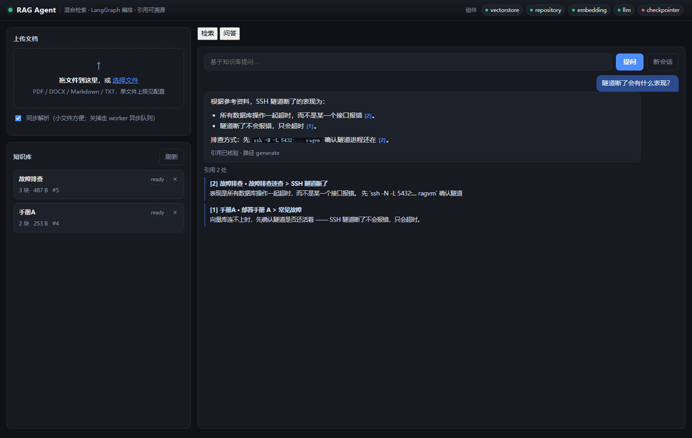
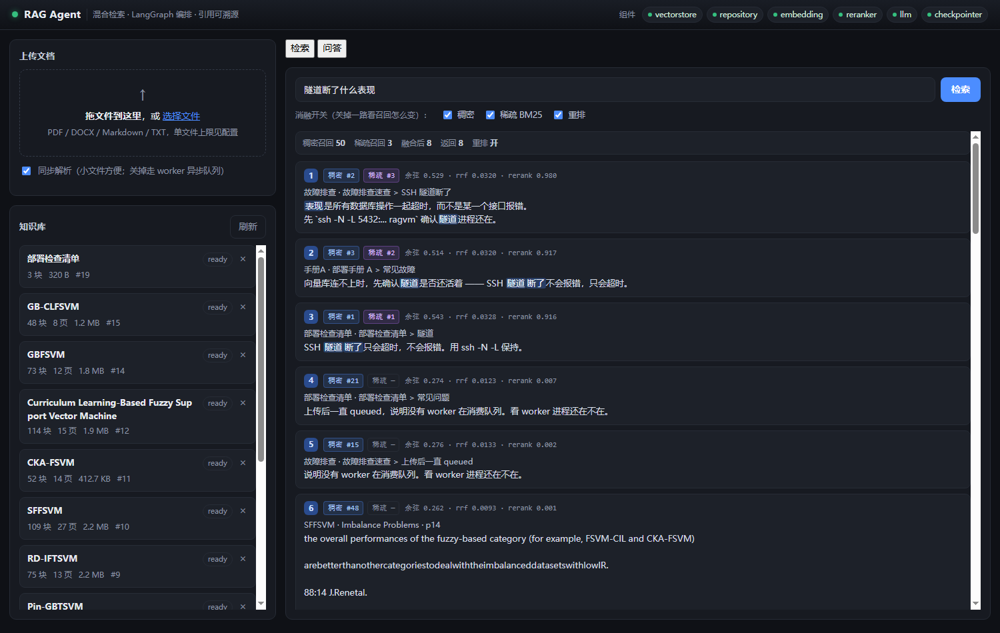

# RAG-Agent

面向 PDF / Word / Markdown 的知识库问答与教务任务服务。Pi Agent 可组合 RAG、课程、成绩、课表、考试和冲突检查工具完成多步骤任务。

**技术栈**：FastAPI · LangGraph · Milvus · PostgreSQL · Neo4j · BGE · Docker

自带一个零构建的 Web 界面（原生 HTML/CSS/JS，无 Node、无 CDN，离线可用），
`uvicorn` 起来后直接访问 `http://127.0.0.1:8000/` 就能上传文档、看任务进度、
做检索和问答。

---

## 快速开始

### 方式一：本地跑通（Windows / macOS，不需要 Docker）

只需要 Python 3.11+ 和本机的 BGE 模型：

```bash
uv venv --system-site-packages .venv     # 复用全局 torch，不重复下载 2.5GB
uv sync --extra dev
cp .env.example .env                      # 按需修改 EMBED_MODEL_PATH

python scripts/smoke_local.py
```

跑通会看到解析 → 分块 → 嵌入 → 入库 → 混合检索 → Agent 全链路，以及 4 条检索断言。

### 打开 Web 界面

```bash
python scripts/run_api.py --port 8000   # 前端由 FastAPI 直接托管，不需要另起服务
python -m rag.worker                    # 第二个终端：异步摄取队列的消费者
# 浏览器打开 http://127.0.0.1:8000/
```

> **嵌入和重排在 GPU 上跑**（默认形态）。`scripts/serve_inference.py` 部署在
> AutoDL，本机通过 SSH 隧道指过去；本机进程不加载任何模型，各占 ~500MB。
> 上传一份 2.2MB 的 PDF，本机 CPU 从 ~81s 降到 ~8s（只剩解析）。
> 模型留在 `EMBED_PROVIDER=local` 也能跑，只是所有算力都压在本机 CPU 上。
> 拓扑、切回去的步骤和向量一致性校验见 [docs/DEPLOY.md](docs/DEPLOY.md) 第四节末尾。

> **为什么要用 `scripts/run_api.py` 而不是 `uvicorn rag.main:app`？**
> 只在 Windows 上有区别。uvicorn ≥0.36 的循环工厂在 win32 上硬编码
> `ProactorEventLoop`，而 psycopg 的 async 模式跑不了它 —— 结果是多轮对话的
> checkpointer **静默降级**，`/readyz` 只报一句 `checkpointer: off`，
> 看着像没配。Linux（Docker / AutoDL）上两者等价，裸 uvicorn 就行。
> 细节见 `src/rag/core/loop.py`。



答案里的 `[n]` 角标可以点，会跳到下面那张引用卡片；卡片标签是
`文档名 · 章节路径 > 小节标题`，用来核对答案到底出自哪一段。

界面分两块，对应两条真实链路：

- **左栏 · 知识库**：拖拽上传。勾着"同步解析"就在请求里直接跑完；
  取消勾选则走 worker 异步队列，界面会实时显示 `queued → running → succeeded`。
- **右栏 · 检索 / 问答**：检索页每张结果卡片上有一对
  **「稠密 #n / 稀疏 #n」**角标 —— 那是两个召回通道各自排出的名次。
  同一张卡上两个名次差得越远，越能说明 RRF 融合在做什么。
  三个消融开关可以现场关掉某一路，直观看到召回数量的变化。



每张卡片右边那三个数是**三个不同的分，不要混着看**：

| 字段 | 含义 | 能不能判断相关性 |
|---|---|---|
| `余弦` | 稠密通道的原始余弦相似度 | 弱。领域内 0.51~0.60、领域外 0.29~0.49，**区间重叠** |
| `rrf` | RRF 融合分 | **不能**。只看名次 —— rank 1 恒为 `1/(60+1)=0.0164` |
| `rerank` | cross-encoder 重排分 | **能**。相关 0.98 / 无关 0.0001，差三个数量级 |

> 这也是本项目最容易踩的坑：拿 `rrf` 当相关性分看，会以为"不相关的内容也被排在第一位"
> —— 它本来就只表达名次。**重排分才是那个能判"像不像"的量。**

> **上传后一直停在 `queued`？** 说明没有 worker 在消费队列。
> 两个原因：`REPOSITORY_BACKEND=memory`（根本没有任务表），或者 worker 进程没起。
> 界面会在 15 秒后把这张卡片标成"疑似卡住"并直接给出这两条排查方向 ——
> 默认情况下"正在处理"和"卡死了"长得一模一样，这是本项目最容易卡住的地方。

界面支持深链，演示时甩一条链接过去就行，不用现场打字：

| 链接 | 效果 |
|---|---|
| `/?q=隧道断了什么表现` | 直接跑检索并出结果 |
| `/?tab=chat&ask=隧道断了什么表现` | 直接切到问答页并把问题发出去 |

### 方式二：Docker 一键起（Ubuntu 服务器 / 虚拟机）

```bash
cp .env.example .env
docker compose up -d --build
```

模型权重放在 `./models/`（不进镜像、不进 git）：

```
models/
├── bge-m3/
└── bge-reranker-v2-m3/
```

完整的部署方案、GPU 配置、AutoDL 注意事项见 **[docs/DEPLOY.md](docs/DEPLOY.md)**。

---

## 文档

| 文档 | 内容 |
|---|---|
| [docs/RETRIEVAL_AUDIT.md](docs/RETRIEVAL_AUDIT.md) | 召回率根因、BGE-M3 双索引升级、前后评测与回滚说明 |
| [docs/DEPLOY.md](docs/DEPLOY.md) | 部署方案：模型跑在哪、GPU、AutoDL、上线检查清单 |
| [docs/SPEC.md](docs/SPEC.md) | 完整技术规格：数据模型、分块策略、检索、接口、NFR、风险登记 |
| [docs/INTERNSHIP.md](docs/INTERNSHIP.md) | 求职版本：四周计划、JD 关键词映射、消融实验、面试问答 |
| [docs/RESUME.md](docs/RESUME.md) | STAR 简历条目 + 实测数字的复现方式（**可写的 / 还不能写的分开列**）|
| [docs/RAG_PROJECT_CASE_STUDY.md](docs/RAG_PROJECT_CASE_STUDY.md) | 完整项目复盘：问题、根因、解决方案、证据、责任边界与优化路线 |
| [docs/AGENT_V1.md](docs/AGENT_V1.md) | RAG → Agent Tool V1：代码审计、调用链、启动、测试、Demo 与限制 |
| [docs/AGENT_V2.md](docs/AGENT_V2.md) | 教务 Agent V2：多 Tool Loop、Task State、多轮任务、错误恢复与 Demo |

---

## 架构

```
                    ┌──────────────┐
   PDF/Word/MD ───→ │  解析器       │ → DocNode 树（标题层级/页码/字符偏移）
                    └──────┬───────┘
                           ↓
                    ┌──────────────┐
                    │ 结构感知分块  │ 表格/代码保持原子，章节边界强制切断
                    └──────┬───────┘
                           ↓
              ┌────────────┴────────────┐
              ↓                         ↓
      ┌───────────────┐         ┌──────────────┐
      │  PostgreSQL   │         │   Milvus     │
      │  正文权威存储  │         │ 稠密+BM25稀疏 │
      │  + 任务表      │         │ + 标量索引    │
      └───────┬───────┘         └──────┬───────┘
              └────────────┬───────────┘
                           ↓
                    ┌──────────────┐
      query ──────→ │  混合检索     │ 稠密 + BM25 → RRF 融合 → 重排 → top-k
                    └──────┬───────┘
                           ↓
                    ┌──────────────┐
                    │ Pi Agent     │ Observe → Decide → 0..N Tools → Evaluate
                    └──────┬───────┘
                           ↓
                    ┌──────────────┐
                    │ Harness      │ Task State · 错误恢复 · 8 轮上限 · 引用校验
                    └──────────────┘
```

工具包括 `search_knowledge`、`search_courses`、`query_grades`、`query_schedule`、
`query_exam` 和 `check_schedule_conflict`。原有 LangGraph RAG 图仍保留，可供旧链路、
对照实验和后续节点复用；`/api/v1/chat` 由 `AgentHarness` 统一驱动。运行 Agent 验收：

```bash
uv run pytest
```

---

## 三个设计取舍

**① 混合检索，而不是纯向量。**
稠密向量对专有名词、型号、条款编号几乎无感（训练时没见过，会被平均掉），BM25 恰好补这一块；反过来 BM25 处理不了同义改写。两者互补。融合用 RRF 而不是加权求和 —— 余弦分和 BM25 分量纲不同，归一化对异常值极其敏感，而 RRF 只看名次，免调参。

**② PostgreSQL 任务表，而不是 Celery + Redis。**
`SELECT ... FOR UPDATE SKIP LOCKED` 提供原子领取、崩溃后重领、幂等重试，一张表替代一套中间件。代价是没有优先级队列和定时任务 —— 那些场景才需要上 Celery。

**③ 模型通过 Protocol 抽象，local / api / none 自由切换。**
`EMBED_PROVIDER=local` 是模型跑在 API 进程里，`=api` 是跑在独立推理服务里。**两者都可以完全离线**。切换只改配置，检索层代码一行不动 —— 消融实验的基线组和实验组因此走的是同一条代码路径。

---

## 目录结构

```
src/rag/
├── core/        配置、结构化日志（含脱敏）、错误类型
├── schemas/     DocNode / Chunk / Citation
├── parsers/     PDF / DOCX / Markdown → DocNode 树
├── chunking/    结构感知分块 + token 计数
├── providers/   embedding / reranker / llm 的多实现
├── infra/       Postgres ORM、Milvus、教务读模型、Task State、仓储
├── services/    教务查询、摄取管道、检索管道、RRF 融合
├── agent/       Pi Agent、六个 Tool、Task State、Harness、Prompt、保留的 LangGraph
├── worker/      后台摄取进程（python -m rag.worker）
└── api/         HTTP 路由 + static/（Web 界面，由 FastAPI 直接托管）
scripts/
├── smoke_local.py     不需要 Docker 的端到端验收
├── smoke_worker.py    任务生命周期（重试/租约/越界），不需要 Postgres
├── smoke_worker_pg.py 任务队列的裸 SQL 验证，需要真 Postgres
├── smoke_milvus_lite.py  Milvus Lite 能力探测
├── shot_ui.py         改完界面后截图验收（走 CDP，能等流式问答渲染完）
├── serve_inference.py GPU 推理服务：TEI 兼容的 /embed 与 /rerank（跑在 AutoDL）
├── seed_academic_demo.py V2 教务 Demo 数据（幂等写入 PostgreSQL）
└── setup_autodl.sh    AutoDL 一键初始化
```

---

## 常见问题

**检索结果里没有我上传的内容？**
先确认文档状态是 `ready`（不是 `failed` / `needs_ocr`）。扫描版 PDF 没有文本层，一期不支持 OCR。

**`Embedding 模型加载失败`？**
`EMBED_MODEL_PATH` 必须指向包含 `config.json` 和 `pytorch_model.bin` 的**目录**，不是文件。

**Milvus 反复重启？**
`grep -m1 -o avx2 /proc/cpuinfo` —— 没有输出说明 CPU 不支持 AVX2，Milvus 无法运行。

**改分块参数后检索结果没变？**
`CHUNKER_VERSION` 必须同步 bump，否则增量索引会复用旧块。

**传了 `sync=false`，文档一直停在 `pending`？**
任务写进了 `jobs` 表但没人消费 —— worker 没跑。`python -m rag.worker` 起一个，
或者本地就先用默认的 `sync=true`。细节见 [docs/DEPLOY.md](docs/DEPLOY.md) 第六节。

**worker 起来了但一直空转，日志里什么都没有？**
多半是 `REPOSITORY_BACKEND=memory` —— 独立进程看不见 API 进程里的内存队列。
启动时应该已经被拦下来了，如果没有，检查这条配置。
